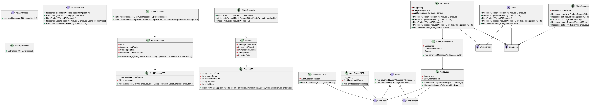

# trabalho-dm110

[](https://github.com/LucasSResende/IDP_Project3/actions/workflows/cicdProject3.yml)
<h1 align="center">DM110 Final Project</h1>

## 🎓 About Project

This project is a Java EE application that manages product storage and audit logging.
It provides RESTful services for querying and managing product information, such as
product codes, stored amounts, minimum amounts, location, and entry date. Additionally,
the application logs audit messages for product storage events and other relevant actions,
utilizing Java Messaging Services (JMS) for sending these messages asynchronously to an audit queue.

---

## 📜 Technologies

The following tools were used in the construction of the project:

- Java 17
- Maven
- Wildfly
- HSQLDB


### Tools

- Intellij
- Postman


---

## 📁 Class Diagram

###         

### Sequence Diagrams

The class diagram represents the overall structure of the application, detailing the interaction between various
components:

- **Audit**: Interfaces and classes responsible for audit logging. The `AuditBean` contains methods to save and retrieve
  audit logs, while the `AuditQueueSender` sends messages to the JMS queue.
- **Product Management**: Interfaces and classes responsible for product storage management. The `StoreBean` manages
  products, and the `StoreResource` exposes the REST API endpoints.
- **Converters**: Utility classes that convert between entity objects (`Product`, `AuditMessage`) and their transfer
  object (TO) equivalents (`ProductTO`, `AuditMessageTO`).
- **REST Resources**: `AuditResource` and `StoreResource` provide RESTful endpoints for interacting with the
  application’s core functionalities.

<p align="center" style="display: flex; flex-direction: column; align-items: flex-start; justify-content: center;">
    <p align="center" style="display: flex; align-items: flex-start; justify-content: center;">
    
    </p>

The diagram includes:

- Beans for business logic (`AuditBean`, `StoreBean`).
- Entity classes for persistence (`Product`, `AuditMessage`).
- REST resources for external interaction.
- Interfaces and services (`AuditLocal`, `StoreLocal`) for audit logging and product management.

---

## 🚀 How to Clone and Run the Project

To clone and run this project locally, follow these steps:

1. Clone the repository from GitHub:
    ```bash
    git clone https://github.com/izaltinoromao/trabalho-dm110.git
    ```

2. Navigate to the project directory:
    ```bash
    cd trabalho-dm110
    ```

3. Use Maven to build the project:
    ```bash
    mvn clean install
    ```

4. Deploy the EAR file (`trabalho-ear-1.0.ear`) to your WildFly application server. Ensure WildFly is running locally.
   To deploy via the WildFly CLI, run the following:
    ```bash
    cd {path-to-wildfly}/bin
    ./jboss-cli.sh --connect --command="deploy {path-to-ear}/trabalho-ear-1.0.ear"
    ```

5. Start WildFly if it is not already running:
    ```bash
    ./standalone.sh
    ```

6. Access the application’s RESTful endpoints via the appropriate URLs, for example:
    - Get all product codes: `http://localhost:8080/trabalho-dm110/api/store/products`
    - Store a new product: `http://localhost:8080/trabalho-dm110/api/store/products`

7. To view audit logs, use the following endpoint:
    - Get all audits: `http://localhost:8080/trabalho-dm110/api/audit`

8. You can use any REST client (like Postman) to make GET/POST requests to these endpoints.

---

## ✉️ Endpoints and Payloads

### Product Endpoints

#### 1. Get all products

- **URL**: `/api/store/products`
- **Method**: GET
- **Description**: Fetches the list of all products stored in the system.
- **Example Response**:
    ```json
    [
      {
        "productCode": "P001",
        "amount": 100,
        "minAmount": 10,
        "location": "A1",
        "entryDate": "2024-01-01"
      },
      {
        "productCode": "P002",
        "amount": 50,
        "minAmount": 5,
        "location": "B2",
        "entryDate": "2024-02-15"
      }
    ]
    ```

#### 2. Get product by code

- **URL**: `/api/store/products/{productCode}`
- **Method**: GET
- **Description**: Retrieves the details of a specific product by its product code.
- **Example Response**:
    ```json
    {
      "productCode": "P001",
      "amount": 100,
      "minAmount": 10,
      "location": "A1",
      "entryDate": "2024-01-01"
    }
    ```

#### 3. Store a new product

- **URL**: `/api/store/products`
- **Method**: POST
- **Description**: Creates a new product entry in the system.
- **Example Request Payload**:
    ```json
    {
      "productCode": "P003",
      "amount": 200,
      "minAmount": 20,
      "location": "C3",
      "entryDate": "2024-03-10"
    }
    ```
- **Example Response**:
    ```json
    {
      "message": "Product created successfully",
      "productCode": "P003"
    }
    ```

#### 4. Update product amount

- **URL**: `/api/store/products/{productCode}/amount`
- **Method**: PUT
- **Description**: Updates the amount of an existing product by its code.
- **Example Request Payload**:
    ```json
    {
      "newAmount": 150
    }
    ```
- **Example Response**:
    ```json
    {
      "message": "Product amount updated successfully",
      "productCode": "P001",
      "newAmount": 150
    }
    ```

#### 5. Delete a product by code

- **URL**: `/api/store/products/{productCode}`
- **Method**: DELETE
- **Description**: Deletes a product from the system based on its product code.
- **Example Response**:
    ```json
    {
      "message": "Product deleted successfully",
      "productCode": "P001"
    }
    ```

### Audit Endpoints

#### 1. Get all audit logs

- **URL**: `/api/audit`
- **Method**: GET
- **Description**: Retrieves the list of all audit logs.
- **Example Response**:
    ```json
    [
      {
        "id": 1,
        "message": "Product P001 stored with amount 100",
        "date": "2024-01-01T10:00:00"
      },
      {
        "id": 2,
        "message": "Product P002 stored with amount 50",
        "date": "2024-02-15T12:30:00"
      }
    ]
    ```

#### 2. Get audit logs by product code

- **URL**: `/api/audit/{productCode}`
- **Method**: GET
- **Description**: Fetches the audit logs related to a specific product by its product code.
- **Example Response**:
    ```json
    [
      {
        "id": 1,
        "message": "Product P001 stored with amount 100",
        "date": "2024-01-01T10:00:00"
      }
    ]
    ```

### Error Handling

For all endpoints, if an error occurs (e.g., product not found, invalid request), a standard error response is returned.

- **Example Error Response**:
    ```json
    {
      "status": 404,
      "message": "Product not found",
      "timestamp": "2024-10-01T10:15:30"
    }
    ```

## 👥 Authors

<table>
  <tr>
    <td>
      <h4 align="center">
        
      </h4>
      <strong>Izaltino Romão Neto</strong>
      <br>
      <a href="https://www.linkedin.com/in/izaltino-rom%C3%A3o-neto-0b60a8221/">
        
      </a>
      <a href="mailto:izaltino.neto@pg.inatel.br">
        
      </a>
    </td>
<td>
      <h4 align="center">
        
      </h4>
      <strong>Lucas de Souza Resende</strong>
      <br>
      <a href="https://www.linkedin.com/in/lucassresende/">
        
      </a>
      <a href="mailto:l.souza@pg.inatel.br">
        
      </a>
</td>
 </tr>
</table>